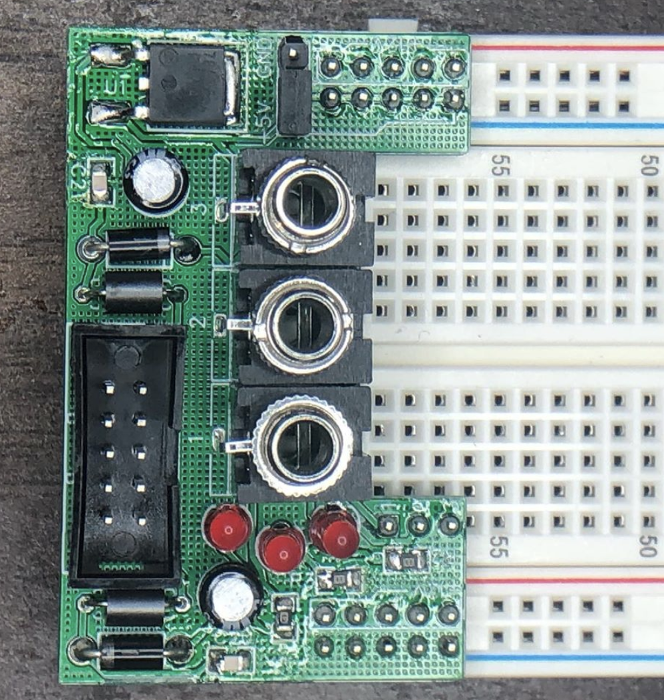

Seems like everyone has to design one of these sooner or later.

The jumper-able 5v/ground on one side is borrowed directly from Transient Modules.

My biggest peeve with Eurorack breadboarding is jacks -- with pots, the Song Huei tall trimmers are easy to come by, cheap, and their legs fit breadboard holes pretty well. But jacks are a pain, so I went ahead & put three on here. The cutout on the board is to give you access to the rows where the jacks' tip contacts come out. Sleeve & switch are both tied to ground for simplicity's sake.

I'm releasing this under a Creative Commons nc-by-sa 4.0 license, which means (in plain English) that you are welcome to use these files for noncommercial purposes, provided that you credit me, and if you modify/remix in some way, you release your version under the same or equivalent license.

I'm not going to write a build doc for this because hopefully it's pretty self-explanatory, but feel free to ask me questions via github issue, or submit a PR with a build doc in it!
