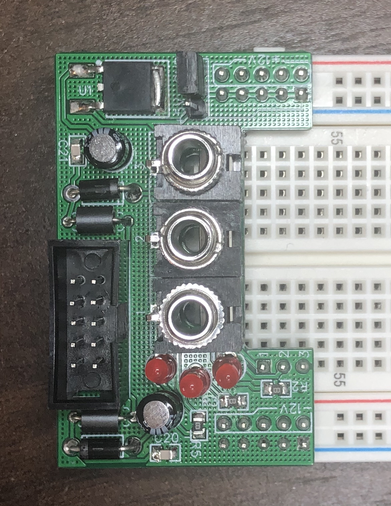

Seems like everyone has to design one of these sooner or later.

The jumper-able 5v/ground on one side is borrowed directly from Transient Modules.

My biggest peeve with Eurorack breadboarding is jacks -- with pots, the Song Huei tall trimmers are easy to come by, cheap, and their legs fit breadboard holes pretty well. But jacks are a pain, so I went ahead & put three on here. The cutout on the board is to give you access to the rows where the jacks' tip contacts come out. Sleeve & switch are both tied to ground for simplicity's sake.
